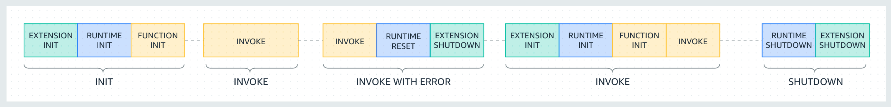

[](https://nodei.co/npm/serverless-aws-lambda/)

## Description

> AWS Lambda dev tool for Serverless. Allows Express synthax in handlers. Supports packaging, local invoking and offline Application Load Balancer and API Gateway lambda server mocking.

- Plug & Play (easy to install, configure and use)
- Highly customizable
- Functions are bundled by [esbuild](https://github.com/evanw/esbuild)
- Offline server uses NodeJS `http` module
- Packaging is made by [node-archiver](https://github.com/archiverjs/node-archiver)

### Supported Runtimes

- NodeJS
- Python
- Ruby

### Minimum requirements

- Node v14.17.0
- Serverless 2.0.0

---

## Table of Contents

- [Installation](#installation)
- [Usage](#usage)
- [Invoke](#invoke)
- [Package](#package)
  - [assets](#assets)
  - [preserveDir](#preservedir)
  - [files](#files)
- [Deploy](#deploy)

- [Advanced configuration](#advanced-configuration)
- [Plugins](#plugins)
- [Benchmarks](#benchmarks)

### Installation

```bash
yarn add -D serverless-aws-lambda
# or
npm install -D serverless-aws-lambda
```

```yaml
service: myapp

frameworkVersion: "3"
configValidationMode: error

plugins:
  - serverless-aws-lambda
```

---

### Usage

Start the local server

```bash
SLS_DEBUG="*" sls aws-lambda -s dev
```

It is also possible to passe port from the CLI with `--port` or `-p`.

This will overwrite serverless.yml custom > serverless-aws-lambda > port value if it is set.

### Invoke

Lambda execution lifecycles.  
Succefull execution:

Failed execution:


Offline server supports Application Load Balancer, API Gateway and Function URL endpoints (see [plugins](#plugins) for more triggers).  
Appropriate `event` object is sent to the handler based on your lambda declaration.

```yaml
functions:
  myAwsomeLambda:
    handler: src/handlers/awsomeLambda.default
    events:
      - alb:
          listenerArn: arn:aws:elasticloadbalancing:eu-west-3:170838072631:listener/app/myAlb/bf88e6ec8f3d91df/e653b73728d04626
          priority: 939
          conditions:
            path: "/paradise"
            method: GET
```

`myAwsomeLambda` is available at `http://localhost:PORT/paradise`

However if your declare both `alb` and `http` or `httpApi` inside a single lambda `events` with the same `path` you have to specify desired server by setting `alb` or `apg` inside your request's:

- header with `X-Mock-Type`.
- or in query string with `x_mock_type`.

Please note that invoking a lambda from sls CLI (`sls invoke local -f myFunction`) will not trigger the offline server. But will still make your handler ready to be invoked.

To invoke your Lambda like with AWS Console's `Test` button, prefix your Lambda name by `@invoke/`.  
Example:

```
http://localhost:3000/@invoke/myAwsomeLambda
```

Function URL is available with `@url/` prefix. (must be enabled inside lambda declaration).  
Example:

```
http://localhost:3000/@url/myAwsomeLambda
```

Invoking with `aws-sdk` Lambda Client:

```js
const { LambdaClient, InvokeCommand } = require("@aws-sdk/client-lambda");

const client = new LambdaClient({ region: "us-east-1", endpoint: "http://localhost:3000" });
const DryRun = "DryRun";
const Event = "Event";
const RequestResponse = "RequestResponse";

const cmd = new InvokeCommand({
  FunctionName: "myAwsomeLambda",
  InvocationType: RequestResponse,
  Payload: Buffer.from(JSON.stringify({ foo: "bar" })),
});

client
  .send(cmd)
  .then((data) => {
    data.Payload = new TextDecoder("utf-8").decode(data.Payload);
    console.log(data);
  })
  .catch((error) => {
    // 🥲
    console.log("error", error);
  });
```

### AWS Lambda Response Stream

Stream responses are supported out of box through Function URL invoke or AWS SDK invoke.  
See example:

```yaml
functions:
  myAwsomeLambda:
    handler: src/handlers/awsomeLambda.default
    url:
      invokeMode: RESPONSE_STREAM # required only for Function URL invoke
```

```ts
// awsomeLambda.ts
import stream from "stream";
import { promisify } from "util";
const pipeline = promisify(stream.pipeline);
import { createReadStream } from "fs";

export const handler = awslambda.streamifyResponse(async (event, responseStream, context) => {
  responseStream.setContentType("image/png");
  // https://svs.gsfc.nasa.gov/vis/a030000/a030800/a030877/frames/5760x3240_16x9_01p/BlackMarble_2016_928m_europe_labeled.png
  const streamImage = createReadStream("BlackMarble_2016_928m_europe_labeled.png");

  await pipeline(streamImage, responseStream);
});
```

Example with AWS SDK:

```ts
import { LambdaClient, InvokeWithResponseStreamCommand } from "@aws-sdk/client-lambda";

const client = new LambdaClient({
  region: "eu-west-3",
  endpoint: "http://localhost:3000",
});

const cmd = new InvokeWithResponseStreamCommand({
  FunctionName: "myAwsomeLambda",
  InvocationType: "RequestResponse",
  Payload: Buffer.from(JSON.stringify({ hello: "world" })),
  ClientContext: Buffer.from(JSON.stringify({ anything: "some value" })).toString("base64"),
});

const data = await client.send(cmd);

for await (const x of data.EventStream) {
  if (x.PayloadChunk) {
    console.log(x.PayloadChunk.Payload);
  }
}
```

---

### Environment variable

Lambdas are executed in worker threads. Only variables declared in your `serverless.yml` are injected into `process.env` except `IS_LOCAL`, `LOCAL_PORT` and `NODE_ENV`.

---

### Package

serverless-aws-lambda bundles every (nodejs) handler separetly (with esbuild) and creates the artifact zip archive.  
Archive will include bundeled handler and sourcemap (if enabled in esbuild).

#### - `assets`

By default bundle produced assets (css, png, svg etc.) are excluded.  
To include all assets set `assets` to true.  
For all functions set it at top-level `package`:

```yaml
package:
  individually: true
  assets: true # default false

functions:
  myAwsomeLambda:
    description: inherits assets from top-level package
    handler: src/handlers/awsomeLambda.default
```

or by function:

```yaml
functions:
  myAwsomeLambda:
    package:
      assets: false
    description: don't includes assets
    handler: src/handlers/awsomeLambda.default
```

include assets by file extension:

```yaml
functions:
  myAwsomeLambda:
    package:
      assets: .css
    description: include only css files
    handler: src/handlers/awsomeLambda.default
```

```yaml
functions:
  myAwsomeLambda:
    package:
      assets:
        - .css
        - .svg
    description: include only css and svg files
    handler: src/handlers/awsomeLambda.default
```

#### - `preserveDir` :

To preserve your project directories structure inside the archive set `preserveDir` globally or at function level.

```yaml
package:
  individually: true
  preserveDir: true # default true

functions:
  myAwsomeLambda:
    description: directories preserved
    handler: src/handlers/awsomeLambda.default

  dummyLambda:
    package:
      preserveDir: false
    description: directories NOT preserved
    handler: src/handlers/dummyLambda.default
```

#### - `files`

include additional files or directories into the package.

```yaml
functions:
  myAwsomeLambda:
    handler: src/handlers/awsomeLambda.default
    package:
      files:
        - ./resources/some/file.png
        - ./resources/anotherFile.pdf
        - ./images
```

By default `files` are inherited from top level `package`'s `files`.  
This can be disabled with `inheritFiles` at function level.

```yaml
functions:
  myAwsomeLambda:
    handler: src/handlers/awsomeLambda.default
    package:
      inheritFiles: false
      files:
        - ./resources/some/file.png
        - ./node_modules/my-module
```

files may be added to the archive with custom path:

```yaml
functions:
  myAwsomeLambda:
    handler: src/handlers/awsomeLambda.default
    package:
      files:
        - { at: "./resources/some/file.png", as: "./documents/important.png" }
```

Adding files with a filter:

```yaml
functions:
  myAwsomeLambda:
    handler: src/handlers/awsomeLambda.default
    package:
      files:
        - { pattern: "./resources/some/*.png" }
```

If you need to preserve `pattern`'s directories structure inside the archive but search for files in another directory set `dir` value.  
This will search for all .png files inside `./resources/images` but only `images` directory will be created inside the archive.

```yaml
functions:
  myAwsomeLambda:
    handler: src/handlers/awsomeLambda.default
    package:
      files:
        - { pattern: "images/*.png", dir: "./resources" }
```

Adding inline files:

```yaml
functions:
  myAwsomeLambda:
    handler: src/handlers/awsomeLambda.default
    package:
      files:
        - { text: "Hello world", dir: "./documents/hello.txt" }
```

---

### Deploy

Adding the param `online: false` will omit the deployement of your Lambda.

```yaml
functions:
  myAwsomeLambda:
    handler: src/handlers/awsomeLambda.default
    online: false
```

To deploy a lambda by stage(s) set `online`'s value to target stage(s)

```yaml
functions:
  lambdaOnlyInDev:
    handler: src/handlers/awsomeLambda.default
    online: dev
```

```yaml
functions:
  lambdaOnlyInDevAndTest:
    handler: src/handlers/awsomeLambda.default
    online:
      - dev
      - test
```

### Extended properties

- `virtualEnvs`  
  a key-value object which will only be available inside [defineConfig](resources/defineConfig.md).  
  by default virtualEnvs are inherited from custom > virtualEnvs if exists.

---

### Advanced configuration:

To have more control over the plugin you can passe a config file via `configPath` param in plugin options:

```yaml
custom:
  serverless-aws-lambda:
    configPath: ./config.default
```

See [defineConfig](resources/defineConfig.md) for advanced configuration.

---

### Plugins:

- [AWS Local S3](resources/s3.md)
- [AWS Local SNS](resources/sns.md)
- [AWS Local SQS](resources/sqs.md)
- [DocumentDB Local Streams](https://github.com/Inqnuam/serverless-aws-lambda-documentdb-streams)
- [DynamoDB Local Streams](https://github.com/Inqnuam/serverless-aws-lambda-ddb-streams)
- [Jest](https://github.com/Inqnuam/serverless-aws-lambda-jest)
- [Vitest](https://github.com/Inqnuam/serverless-aws-lambda-vitest)

---

### Benchmarks

---

### Use [Express](https://expressjs.com) syntax with your lambdas:

[See docs.](resources/express.md)
